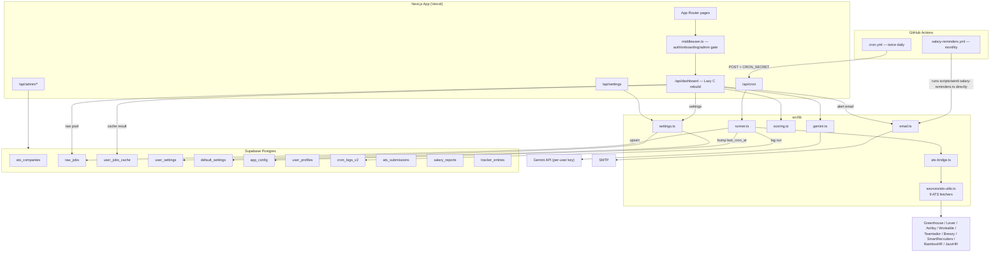

# Job Radar — Architecture

Job Radar is a multi-tenant job-hunting SaaS. It scrapes every job posted by
hundreds of ATS-listed companies — **ingestion is role-agnostic**, pulling
whatever each company has open, not just frontend roles — then filters and
scores each job **per user**, against that user's own skills, seniority
preference, keyword rules, and Gemini prompt.

---

## 1. Tech stack

| Layer           | Choice                                                             |
| --------------- | ------------------------------------------------------------------ |
| Framework       | Next.js 14 (App Router), TypeScript, React 18                      |
| Styling         | Tailwind CSS + inline-style dark theme, GSAP for motion            |
| Database / Auth | Supabase (Postgres + Supabase Auth, Google OAuth)                  |
| AI              | Google Gemini (`@google/genai`), **per-user API key**              |
| Email           | Nodemailer over SMTP                                               |
| Scheduling      | GitHub Actions (cron) calling a protected API route                |
| Testing         | Vitest                                                             |
| Charts          | Recharts                                                           |
| Hosting target  | Vercel (implied by `VERCEL_PRODUCTION_URL`, `maxDuration` exports) |

---

## 2. High-level architecture



---

## 3. Multi-tenancy model

The core architectural shift on this branch is moving every filtering decision out of
hardcoded constants and into per-user, database-backed settings, while keeping the
**expensive, shared work** (scraping) centralized.

- **One shared raw pool, many personal views.** A single cron job scrapes all active
  companies once and writes to `raw_jobs`. This table is _not_ user-specific — it's the
  shared candidate pool. Each user's dashboard then filters and scores that same pool
  against _their own_ `user_settings` row, producing a personal `user_jobs_cache` entry.
  This avoids re-scraping per user while keeping every user's results fully personalized.

- **Ingestion is role-agnostic.** `processJobs()` in
  `sources/ats-utils.ts` performs only geography/timezone eligibility (for the
  `global` pipeline) and a hard 30-day age cap — not role, seniority, or skill
  filtering. Every job a company posts, of any discipline, lands in `raw_jobs`;
  role filtering is entirely a downstream, per-user decision made in the
  settings/scoring gates (§6).

- **Per-field settings inheritance.** `resolveUserSettings()` (`src/lib/settings.ts`)
  merges `user_settings` over `default_settings`, field by field — a user can override
  just `job_age_days` while still inheriting the admin's `expert_skills` list, etc.
  Pipeline toggles, seniority, keyword lists, and weights are always user-controlled.

- **Per-user AI key.** Each user supplies their own Gemini API key
  (`user_profiles.gemini_api_key`). Gemini filtering, and Gemini token cost, is fully
  attributed to the user who owns the key — there's no shared platform key for the
  filtering step. (The `GEMINI_API_KEY` env var, if present, is described as a fallback
  for admin/default operations only.)

- **Role-based access**, not separate tenants/schemas. There is no per-tenant database
  isolation — all users share the same tables, scoped by `user_id`, with admin operations
  using the service-role client to bypass RLS, and `user_profiles.role` gating `/admin`.

---

## 4. Data model

All tables live in the Supabase `public` schema (see `src/lib/database.types.ts` for the
generated types). Inferred relationships are based on `user_id` / foreign-key-shaped
columns; enforce/verify actual FK constraints and RLS policies directly in Supabase, as
they aren't visible from the TypeScript types alone.

| Table              | Purpose                                                                                | Key columns                                                                                                                                                                                                                                                                                                                                                                                                 |
| ------------------ | -------------------------------------------------------------------------------------- | ----------------------------------------------------------------------------------------------------------------------------------------------------------------------------------------------------------------------------------------------------------------------------------------------------------------------------------------------------------------------------------------------------------- |
| `user_profiles`    | One row per authenticated user. Identity, role, Gemini key, onboarding/active flags.   | `id` (= Supabase auth user id), `email`, `role`, `gemini_api_key`, `onboarding_complete`, `is_active`, `last_active_at`                                                                                                                                                                                                                                                                                     |
| `user_settings`    | Per-user filtering/scoring overrides.                                                  | `user_id`, `uses_defaults`, `expert_skills[]`, `secondary_skills[]`, `bonus_skills[]`, `job_age_days`, `pipeline_local/global`, `seniority_levels`, `junior_keywords[]`, `mid_keywords[]`, `senior_keywords[]`, `staff_keywords[]`, `gemini_filter_prompt`, `scoring_weights` (jsonb), `score_denominator`, `excluded_keywords[]`, `blacklisted_locations[]`, `required_keywords[]`, `email_alerts_enabled` |
| `default_settings` | Single-row (`id = 1`) global fallback for every field above. Admin-editable.           | Same shape as `user_settings`, minus `user_id`/`uses_defaults`                                                                                                                                                                                                                                                                                                                                              |
| `ats_companies`    | Source-of-truth company list scraped by the cron job.                                  | `id`, `name`, `ats`, `slug`, `country`, `country_flag`, `city`, `pipeline_local/global`, `is_active`                                                                                                                                                                                                                                                                                                        |
| `ats_submissions`  | Public-facing inbox of company suggestions awaiting admin review.                      | `company_name`, `ats_type`, `slug`, `country`, `status`, `test_result` (jsonb), `reviewed_by`                                                                                                                                                                                                                                                                                                               |
| `raw_jobs`         | Shared pool of scraped jobs, deduped by `id` (a hash of the job URL).                  | `id`, `title`, `company`, `location`, `country`, `url`, `description`, `posted_at`, `fetched_at`, `date_unknown`, `is_remote`, `salary`, `mode` (`visa`/`local`/`global`), `visa_sponsorship`, `source_name`, `ats_type`                                                                                                                                                                                    |
| `user_jobs_cache`  | One row per user: their fully filtered/scored/Gemini-passed job list, ready to render. | `user_id`, `jobs` (jsonb array of `ScoredJob`), `cached_at`, `raw_pool_version`, `pipeline_log` (jsonb)                                                                                                                                                                                                                                                                                                     |
| `app_config`       | Singleton (`id = 1`) global state: last cron timestamp + Workable rate-limit state.    | `last_cron_at`, `workable_blocked` (jsonb), `workable_budget` (jsonb)                                                                                                                                                                                                                                                                                                                                       |
| `cron_logs_v2`     | Append-only audit log of each cron run.                                                | `run_at`, `total_fetched`, `duration_ms`, `errors[]`, `source_health` (jsonb), `trigger`                                                                                                                                                                                                                                                                                                                    |
| `salary_reports`   | Anonymized community-sourced salary data points.                                       | `user_id`, `role_title`, `years_experience`, `salary_egp`/`salary_usd`, `currency`, `pipeline`, `reminder_sent_at`                                                                                                                                                                                                                                                                                          |
| `tracker_entries`  | Per-user kanban-style application tracker.                                             | `user_id`, `job_id`, `job_snapshot` (jsonb), `status`, `notes`, `applied_at`, unique on `(user_id, job_id)`                                                                                                                                                                                                                                                                                                 |

### Cache invalidation

`user_jobs_cache.cached_at` is the freshness signal. It's invalidated in three ways:

1. **Globally**, whenever the cron job finishes — it bumps `app_config.last_cron_at`,
   and `isCacheFresh()` compares `cache.cached_at > config.last_cron_at` per user.
2. **Per-user**, when `/api/settings` PATCH succeeds — the row's `cached_at` is forced
   back to `2000-01-01T00:00:00Z` so the next dashboard load always recomputes.
3. **Globally (admin)**, when `/api/admin/defaults` PUT succeeds — every user's cache is
   force-expired in one update, since a shared default change affects everyone using it.

---

## 5. Request flows

### 5.1 Ingestion — scheduled scrape ("the cron job")

```
GitHub Actions (cron.yml, 07:00 + 16:00 UTC)
  → POST /api/cron  (Authorization: Bearer CRON_SECRET)
    → runCronJob() [src/lib/runner.ts]
       1. Load active companies from ats_companies
       2. Load persisted Workable rate-limit state from app_config
       3. Build one fetch task per (company × enabled pipeline)
       4. Run tasks with an 8-way concurrency limiter against a 270s
          deadline (fetchAllCompanyJobs); tasks not yet dispatched when
          the deadline passes are recorded as skipped instead of run —
          already-in-flight fetches are left to finish, not cancelled
       5. fetchCompany() [ats-bridge.ts] dispatches to the right ATS
          fetcher in sources/ats-utils.ts (9 ATS types), normalizes
          the result into RawJob, and flags date_unknown jobs
       6. Upsert all jobs into raw_jobs (chunks of 500, ON CONFLICT id)
       7. Bump app_config.last_cron_at → invalidates every user's cache
       8. Persist any newly-detected Workable 429s back to app_config
       9. Insert one row into cron_logs_v2 (duration, errors, per-source health)
```

`/api/cron` accepts both `GET` (Vercel Cron, secret as query param) and `POST` (GitHub
Actions / manual, secret as `Authorization: Bearer`), and is the only state-mutating step
that touches the shared `raw_jobs` pool. **No Gemini calls happen here** — filtering is
deferred to each user's own dashboard load.

**Time budget:** `/api/cron` declares `maxDuration = 300` — the actual ceiling on Vercel
Hobby + Fluid Compute, not something this export raises. The fetch phase gets a 270s
slice of that (`FETCH_TIME_BUDGET_MS` in `runner.ts`), leaving 30s for the upsert/email/
logging steps that run after it. A run that would otherwise blow through 300s and hard-504
instead returns partial results, with the untried companies visible as
`"<company> (<mode>): Skipped — time budget exceeded"` entries in `errors` and
`cron_logs_v2`, rather than disappearing silently.

### 5.2 Per-user dashboard load — "Lazy C" rebuild

This is the core multi-tenant read path, implemented in `/api/dashboard`:

```
GET /api/dashboard
  1. Auth check (getUser())
  2. isCacheFresh(user.id)?
       YES → return user_jobs_cache.jobs immediately (instant)
       NO  → rebuild:
         a. Snapshot previous cached job IDs (for "what's new" diffing)
         b. resolveUserSettings(user.id)  — merge user_settings ⊕ default_settings
         c. Require profile.gemini_api_key, else 422
         d. Pull raw_jobs for the user's enabled pipelines (cap: 2000 rows)
         e. passesDateGate()      — drop jobs older than job_age_days
         f. passesSettingsGate()  — seniority / excluded / required / blacklist / skill-match regex
         g. filterJobsWithGemini()— user's own key + custom prompt, batched 15/call, fail-open
         h. scoreJob() per surviving job — skill match, live recency, relocation bonus
         i. mergeJobs([], scored) — drop total_score ≤ 0, sort desc
         j. Upsert user_jobs_cache (jobs, pipeline_log, cached_at, raw_pool_version)
  3. Return { jobs, pipeline_log, cached_at, from_cache }
```

The first dashboard load after a cron run is the only slow one (~10–15s, dominated by
the Gemini calls); every subsequent load for that user is a single cache read until
either the global pool refreshes or the user changes their settings.

### 5.3 Settings update

```
PATCH /api/settings
  - Strip any `role` field (server-enforced; role is never client-settable)
  - gemini_api_key → written to user_profiles (separate table from user_settings)
  - onboarding_complete → written to user_profiles
  - Remaining fields → saveUserSettings() [settings.ts], allow-listed field-by-field
  - Force-expire user_jobs_cache.cached_at → next dashboard load recomputes
```

### 5.4 Authentication & route protection

Auth is Supabase Auth via Google OAuth:

```
/login → Supabase OAuth → /auth/callback?code=...
  → exchangeCodeForSession(code)
  → upsert user_profiles (id, email, last_active_at)
       role and onboarding_complete are NEVER set here — DB defaults apply,
       so the only way to grant 'admin' is direct DB access with the service role.
  → redirect to /onboarding (new user) or /dashboard (returning user)
```

Two layers enforce access control:

1. **`middleware.ts`** — runs on every matched path (`/dashboard`, `/admin`, `/pipeline`,
   `/salary`, `/settings`, `/tracker`). Validates the session via `supabase.auth.getUser()`
   (never trusts a cached JWT), then redirects: unauthenticated → `/login`; blocked user
   (`is_active = false`) → signs out and redirects to `/login?error=blocked`; non-admin on
   `/admin/*` → `/dashboard`; onboarding incomplete → `/onboarding`.
2. **`(protected)/layout.tsx`** — a server-side safety net inside the route group that
   re-checks `getUser()` and redirects to `/login` if somehow reached without a session,
   then renders `AppShell` with `isAdmin` / `userEmail` props.

`/`, `/login`, and `/submit` are the only fully public paths; `/api/cron` is protected by
`CRON_SECRET` rather than session auth, since it's machine-to-machine.

### 5.5 Admin operations

All `/api/admin/*` routes share a `requireAdmin()` guard (looks up
`user_profiles.role` via the service-role client) and return `403` otherwise:

- `GET/POST /api/admin/companies`, `PATCH/DELETE /api/admin/companies/[id]` — CRUD on the
  scraped company list.
- `GET /api/admin/submissions`, `PATCH /api/admin/submissions/[id]` — review the public
  `/submit` queue. Setting `status: "approved"` on `PATCH` inserts a new row directly
  into `ats_companies` (using the submission's data, or an admin-edited name/slug/ATS
  type) in addition to updating the submission's own `status`/`reviewed_at`/`reviewed_by`.
- `POST /api/admin/test-ats` — live-tests a candidate company's ATS slug via the same
  `fetchCompany()` bridge used by the cron job, without writing to `raw_jobs`.
- `GET/PUT /api/admin/defaults` — read/update the single `default_settings` row; a
  successful `PUT` force-expires **every** user's cache.
- `GET /api/admin/users`, `PATCH /api/admin/users/[id]` — list users and toggle
  `is_active` only; `role`, `id`, and `email` are explicitly stripped from the payload
  before the update, and an admin is blocked from deactivating their own account. `role`
  is enforced as immutable from the app layer at every entry point (auth callback,
  `/api/settings`, this route) and is additionally backed by an RLS policy — the only way
  to grant `admin` is direct database access with the service-role key.

---

## 6. Filtering & scoring pipeline

Implemented across `scoring.ts`, `settings.ts`, and `gemini.ts`, run once per user per
dashboard rebuild, cheapest filter first so Gemini only ever sees jobs that already
survived the free stages:

1. **Date gate** (`passesDateGate`) — drop jobs older than the user's `job_age_days`.
   Jobs with no parseable posted date (`date_unknown`) age from `fetched_at` instead of
   being treated as permanently fresh.
2. **Settings gate** (`passesSettingsGate`) — regex-based, all driven by the user's
   resolved settings, never hardcoded:
   - **Seniority gate**: checks if the job's title matches any seniority
     keyword (junior/mid/senior/staff) and whether that level is in the user's
     selected `seniority_levels`. Unlabelled titles pass through. The user
     selects which levels they want in `/settings`.
   - **Excluded keywords** — reject if the title matches any (word-boundary regex).
   - **Required keywords** — reject unless title+description+location matches at least
     one (falls back to `expert_skills` if the user hasn't set explicit required
     keywords).
   - **Blacklisted locations** — reject if title/description/location matches (e.g.
     specific countries, "no visa sponsorship," "must be a US citizen").
   - **Skill match floor** — reject if zero expert _or_ secondary skills are found in
     the description at all.
3. **Gemini gate** (`filterJobsWithGemini`) — batches of 15 jobs sent to the user's own
   Gemini key with their custom evaluation criteria (`gemini_filter_prompt` — criteria
   only; the JSON response contract is fixed and code-owned, appended at call time, not
   stored in user-editable text). Each job is identified to Gemini by its position in
   the batch (`idx`), not its database id — short integers round-trip reliably, long
   composite ID strings don't. **Fails open**: if a batch errors, every job in it passes
   rather than being silently dropped; any job whose `idx` Gemini's response doesn't
   address, or returns invalid/duplicate, also defaults to pass — but this is now logged
   loudly (`console.error` with the raw response attached), not silent.
   - Model fallback queue: `gemini-3.1-pro-preview` → `gemini-3.1-flash-lite-preview` →
     `gemini-2.5-pro` → `gemini-2.5-flash` → `gemini-2.5-flash-lite`. Auth errors
     (invalid key) abort immediately rather than cycling models; other errors (429,
     unsupported model, server error) advance to the next model in the queue.
4. **Scoring** (`scoreJob`) — applied to everything that survived stage 3:
   - `skill_match_score`: expert skill hits worth 3 points, secondary worth 1, normalized
     against `score_denominator` and capped at 100.
   - `recency_score`: always computed live from the current clock (`100 − (ageDays/7)×100`,
     floored at 0) — never frozen at insert time, so it decays correctly even for cached
     jobs.
   - `relocation_bonus`: 100 if the job mentions relocation/visa sponsorship/work permit,
     or is explicitly flagged `visa_sponsorship`.
   - `total_score = skill×w_skill + recency×w_recency + relocation×w_relocation`, with
     user-configurable weights (`scoring_weights`, auto-normalized to sum to 1).
   - **Bonus skills** (e.g. Docker, AWS) are matched and shown but never affect the score.
5. **Merge/dedupe** (`mergeJobs`) — drops any job with `total_score ≤ 0`, dedupes by job
   `id`, keeps the newer `fetched_at` on conflict, sorts descending by score.

---

## 7. ATS ingestion layer

`src/lib/sources/ats-utils.ts` implements nine independent ATS fetchers — Greenhouse,
Lever, Ashby, Workable, Teamtailor, Breezy, SmartRecruiters, BambooHR, JazzHR — each
returning a normalized `Job[]`. Shared concerns handled in this file:

- **Relative date parsing** (`parseRelativeDate`) and **country/timezone detection**
  (`detectCountry`, `isTimezoneIncompatible`) applied uniformly across sources.
- **HTML stripping** (`stripHtml`) and a bounded **`safeFetch`** (45s per-attempt
  timeout, 90s total-wall-clock ceiling across every attempt/backoff combined — see
  below) for resilience against slow/unresponsive ATS endpoints.
- **Concurrency limiting** (`pLimit`) for fan-out within a single ATS call, separate from
  the cross-company limiter in `runner.ts`.
- **Per-host lane pools** (`src/lib/sources/ats/http.ts`'s `queueByHost`,
  `HOST_LANE_COUNT` = 2; mirrored in `workable.ts`'s `queueWorkable`,
  `WORKABLE_LANE_COUNT` = 2): every ATS that serves all companies from one shared
  host (Greenhouse, Lever, Ashby, SmartRecruiters, JazzHR, Breezy, Teamtailor,
  Workable) routes through `HOST_LANE_COUNT` independent staggered chains per host,
  not one fully-serial queue — a single serial chain scales wall-clock time linearly
  with total request count on that host across every company in the run, which is
  what caused the Workable 504 (see §"Known regressions" below) and was latent here
  too until it was actually exercised hard enough (SmartRecruiters' per-company
  detail-page fanout shares one host across every SmartRecruiters company). Each
  `safeFetch`/`fetchWorkableUrl` call additionally enforces its own 90s total-time
  ceiling independent of retry count, since a lane is a serial chain — one request
  stuck retrying would otherwise hold up everything queued behind it in that lane for
  up to the full theoretical worst case (~270s), regardless of any dispatch-level
  deadline the caller checks before starting new work (see `fetch-jobs.ts` below).
  Workable's queue is additionally paired with a persisted blocklist
  (`isWorkableBlocked` / `markWorkableSlugsBlocked24h`) and budget config, loaded
  from / flushed to `app_config` (`loadWorkableStateFromDB`, `flushWorkable429sToDB`)
  so it survives across stateless serverless invocations, which don't share memory or
  disk between cron runs. Lane counts and the 90s ceiling are informed defaults, not
  measured ones — none of these ATS types publish a rate limit for their
  unauthenticated endpoints, so they're tuned against `cron_logs_v2` duration and
  429 count after live runs, not a documented number.
- **Logging**: `safeFetch`/`fetchWorkableUrl` (per request: host/slug, attempt,
  status, elapsed ms), `fetch-jobs.ts` (per company+mode: dispatch start, done, or
  skipped-past-deadline), and `runner.ts` (per phase: companies loaded, workable
  state loaded, fetch phase start/end, upsert done) all `console.log`/`warn`/`error`.
  This exists because there was previously zero logging anywhere in the fetch
  pipeline — when Vercel hard-kills a run at the `maxDuration` ceiling, the function
  dies before the `cron_logs_v2` insert ever runs, so without these lines a killed
  run leaves no trace anywhere. Retrieve via `vercel logs <deployment-url>` (Hobby
  plan retains runtime logs for 1 hour) or the Vercel dashboard's Logs tab.
- **`processJobs()`** — the shared normalization step every fetcher funnels through.
  Applies only geography/timezone eligibility (for the `global` pipeline) and a hard
  30-day age cap; it does **not** filter by title, role, or skill — that gate was
  removed on purpose when the app went multi-tenant (see §3).

`src/lib/ats-bridge.ts` is a thin adapter layer: it converts a `ats_companies` DB row
into the `ATSConfig` shape the fetchers expect, dispatches to the right fetcher based on
`row.ats`, and normalizes the result into the `RawJob` shape used by the rest of the
pipeline (including the `date_unknown` heuristic: if a parsed `postedAt` lands within 30
seconds of `fetchedAt`, it's treated as a fallback/unknown date rather than a real one).

---

## 8. Security model

- **Two Supabase clients, deliberately separated**:
  - `createServerClient()` / browser `createClient()` — anon key, RLS-enforced, used for
    identity (`getUser()`) and any client-facing reads that should respect row-level
    security.
  - `createAdminClient()` — service-role key, **bypasses RLS entirely**. Used for cron
    writes, admin routes, and any cross-user read/write (e.g. dashboard route reading
    another table's shared `raw_jobs`). Explicitly documented as server-only / never to
    be exposed to the browser.
- **`role` is write-protected** at the application layer: `/api/settings` PATCH strips
  any client-supplied `role` field before processing, and `/auth/callback` never sets
  `role` on profile upsert — it can only be changed via direct database access with the
  service-role key, not through any API surface.
- **`CRON_SECRET`** gates `/api/cron`, checked via either `Authorization: Bearer` (CI) or
  a `secret` query param (Vercel Cron GET). There's no in-app UI that triggers a scrape —
  the admin page (`/admin`) only _displays_ `cron_logs_v2` history; the scrape is only
  ever invoked by GitHub Actions or a manual `curl`/`pnpm run cron`. The secret never
  appears in any client-rendered code, since nothing in the UI references it.
- **Blocked users**: `user_profiles.is_active = false` is checked in middleware on every
  request to a protected path; a blocked user is actively signed out and redirected, not
  just hidden from UI.
- **Per-user secrets stay per-user**: each user's Gemini key lives in `user_profiles` and
  is only ever read server-side to make Gemini calls on that user's behalf — it's never
  returned to the client (`/api/settings` GET only returns `has_gemini_key: boolean`).

---

## 9. Email & scheduling

| Workflow                                 | Trigger                 | Calls                                                               | Auth needed                                                                    |
| ---------------------------------------- | ----------------------- | ------------------------------------------------------------------- | ------------------------------------------------------------------------------ |
| `.github/workflows/cron.yml`             | 07:00 + 16:00 UTC daily | `POST /api/cron`                                                    | `CRON_SECRET`, `VERCEL_PRODUCTION_URL`                                         |
| `.github/workflows/salary-reminders.yml` | 1st of month, 09:00 UTC | Runs `scripts/send-salary-reminders.ts` directly (not an API route) | `SUPABASE_URL`, `SUPABASE_SERVICE_ROLE_KEY`, `SMTP_*`, `VERCEL_PRODUCTION_URL` |

Both can also be run locally/manually: `pnpm run cron`, `pnpm run salary-reminders`.

Two email types, both sent via Nodemailer/SMTP (`src/lib/email.ts`):

- **Scan complete** — sent after each cron run to eligible users
  (`email_alerts_enabled = true`). Generic notification that new jobs are
  available; no job listings included. Gated by `companiesScanned > 0`.
- **Monthly salary reminder** — sent to users whose most recent `salary_reports`
  entry is stale, via the standalone monthly script/workflow above.

---

## 10. Directory structure

```
src/
├── middleware.ts                 # Route-level auth/onboarding/admin gate
├── app/
│   ├── page.tsx                  # Public landing page
│   ├── login/                    # OAuth login
│   ├── onboarding/                # First-run settings setup
│   ├── submit/                    # Public "suggest a company" form
│   ├── job/[id]/                  # Job detail page
│   ├── auth/callback/             # Supabase OAuth callback handler
│   ├── (protected)/                # Auth-required route group (URL-transparent)
│   │   ├── layout.tsx              # Server-side auth re-check + AppShell
│   │   ├── dashboard/              # Main personalized job feed
│   │   ├── pipeline/               # Pipeline funnel visualization
│   │   ├── settings/               # Per-user settings form
│   │   ├── salary/                 # Salary explorer + submission
│   │   ├── tracker/                # Application kanban tracker
│   │   └── admin/                  # role='admin'-only pages
│   └── api/
│       ├── cron/                   # Scrape trigger (CRON_SECRET-gated)
│       ├── dashboard/               # Lazy-C per-user rebuild
│       ├── settings/                 # Get/patch resolved + raw settings
│       ├── jobs/[id]/                 # Single job lookup from user's own cache
│       ├── strategy/                  # On-demand Gemini application strategy
│       ├── submit/                     # Public company submission intake
│       ├── salary/                      # Salary aggregate + submission
│       ├── tracker/, tracker/[id]/       # Tracker entry CRUD
│       └── admin/                         # companies, defaults, submissions, users, test-ats
├── components/                    # admin/, dashboard/, layout/, onboarding/,
│                                   # pipeline/, salary/, settings/, tracker/
├── lib/
│   ├── runner.ts                  # Cron orchestrator (companies → raw_jobs)
│   ├── ats-bridge.ts              # DB row → ATS fetcher adapter
│   ├── sources/ats-utils.ts       # 9 ATS fetchers + shared scrape utilities
│   ├── settings.ts                # Default ⊕ user settings resolution
│   ├── scoring.ts                 # Date/settings gates + scoring + merge/dedupe
│   ├── gemini.ts                  # Per-user Gemini filtering + strategy generation
│   ├── email.ts                   # Job alert + salary reminder emails
│   ├── constants.ts               # Shared skill registry / seniority / geo constants
│   ├── database.types.ts          # Generated Supabase schema types
│   ├── types.ts                   # Domain types (RawJob, ScoredJob, ResolvedSettings, …)
│   └── supabase/
│       ├── admin.ts                # Service-role client (RLS bypass, server-only)
│       ├── server.ts               # Cookie-bound SSR client + getUser()/getUserProfile()
│       └── client.ts                # Browser client (anon key + RLS)
├── types/                          # Modular shared types (job, health, api, state, scoring, market)
└── scripts/cron.ts                 # Local entrypoint for `pnpm run cron`
scripts/send-salary-reminders.ts    # Local/CI entrypoint for the monthly reminder job
```

---

## 11. Testing

Vitest specs live in `src/lib/__tests__/`, covering the scoring/gating logic, settings resolution, the ATS bridge adapter, the cron orchestrator, Gemini filtering, email notifications, domain-counts persistence, account deletion, and salary route handling. Run with `pnpm test`.

---

## 12. Migration model

The system was rebuilt from a single-user tool into a multi-tenant platform. The original single-user ingestion fetchers (`sources/ats-utils.ts`) were extended with new features (per-user seniority config, atomic domain counts, Teamtailor/Breezy tracking, Supabase-backed rate limiting) rather than replaced. The multi-tenant layer was built as new files (`runner.ts`, `ats-bridge.ts`, `/api/cron`, `/api/dashboard`, `middleware.ts`) that import and adapt the fetchers. `ats-bridge.ts` reshapes data between the fetcher signatures and the new DB-backed types.

---

## 13. Environment variables

```env
SUPABASE_URL=                     # service-role access (server only)
SUPABASE_SERVICE_ROLE_KEY=        # server only — never expose to the browser
NEXT_PUBLIC_SUPABASE_URL=         # anon/browser client
NEXT_PUBLIC_SUPABASE_ANON_KEY=    # anon/browser client
CRON_SECRET=                      # shared secret for /api/cron
SMTP_HOST=
SMTP_PORT=
SMTP_USER=
SMTP_PASS=
NEXT_PUBLIC_APP_URL=
```

GitHub Actions additionally requires `VERCEL_PRODUCTION_URL` as a repo secret (target
host for the cron POST), alongside the same Supabase/SMTP secrets above.
